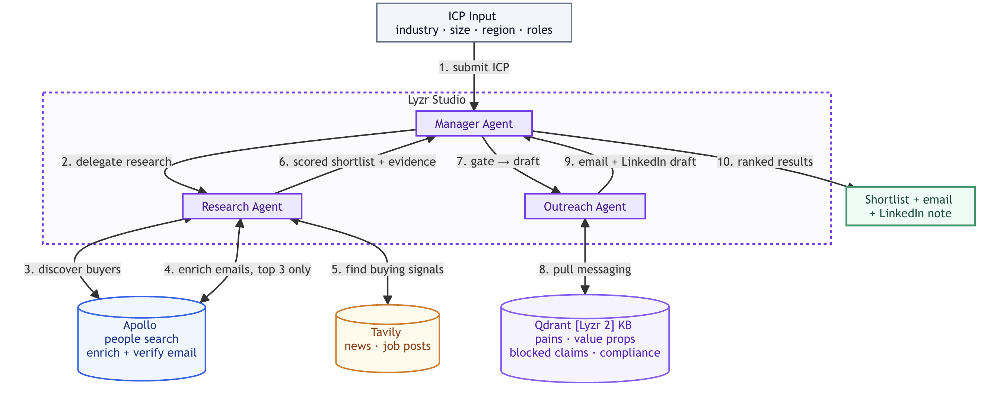

# Prospect Outreach Agent

Prospect research and outreach agent, using Gong as an example seller. Three agents run on Lyzr Studio (Research, Outreach, Manager). Deterministic scoring and citation checks run as local Python tools between agent calls. A local FastAPI backend and web UI drive the flow.



> Privacy and disclaimer: Prospect data (contacts, emails, enrichment) and the KB are kept local and excluded from this repo to protect individuals' privacy. All local prospect data will be deleted by Oct 13, 2026. Gong is used only as an example seller for demonstration. This app is not affiliated with, endorsed by, or connected to Gong.

## 1. Prerequisites

- Python 3.11+
- The three agents and the playbook KB deployed in Lyzr Studio
- Tavily API key (optional, for live signals)
- Apollo API key (live mode only)
- `data/prospects.json` for seed mode. It's not included in this repo, so supply your own prospect file in the same format.

## 2. Setup

```bash
# from the repo root
python3 -m venv .venv && source .venv/bin/activate   # optional but recommended
pip install -r app/requirements.txt

cp .env.example .env   # then fill in the values below
```

Fill `.env` (gitignored, never commit it):

| Key | What it is |
| --- | --- |
| `LYZR_API_KEY` | Studio API key (`sk-default-…`) |
| `LYZR_USER_ID` | Studio account email |
| `LYZR_MANAGER_AGENT_ID` / `LYZR_RESEARCH_AGENT_ID` / `LYZR_OUTREACH_AGENT_ID` | The three agent IDs |
| `LYZR_KB_ID` | Playbook KB ID |
| `TAVILY_API_KEY` | Tavily key (free, optional live signals) |
| `APOLLO_API_KEY`, `STUDIO_APOLLO` | Apollo (live mode only) |
| `LYZR_LIVE` | `0` = seed mode (default, no Apollo calls). `1` = allow the Apollo-backed Research agent. |
| `SUPABASE_URL` | Evidence-cache API URL (locally, run `supabase start` and use its API URL). Leave blank to run without a cache. |
| `SUPABASE_KEY` | Supabase anon key from `supabase start` |
| `CACHE_ENABLED` | `1` = use the evidence cache (default), `0` = disable |
| `CACHE_TTL_DAYS` | Cache entry TTL in days (default `7`) |

## 3. Run

```bash
uvicorn app.server:app --reload --port 8000   # from the repo root
```

Open http://localhost:8000

- Dashboard: set count, region, and persona, then click Run prospecting. The tool timeline shows each step (filter → score → gate → Outreach → verify). Click any row for the score breakdown, signals, and email/LinkedIn drafts, then copy or export to CSV.
- Chat: type `find 5 CROs at US software companies` to run a seed job and fill the dashboard.
- Knowledge base: query the playbook KB directly.

## 4. Modes and credits

- Seed (default): reads `data/prospects.json` (30 pre-enriched buyers) and uses no Apollo credits. Only the Outreach agent and optional Tavily are called. The Apollo path stays off unless `LYZR_LIVE=1`.
- Live: set `LYZR_LIVE=1` to let the Research agent call Apollo.

## 5. Tests and evals

```bash
pytest -q                                    # deterministic tools + eval harness (100 tests)
python eval/harness.py                       # local replay, 0 credits: deterministic checks + gate
python eval/harness.py --mode judge          # live Gemini relevance judge (Lyzr credits, no Apollo)
python eval/harness.py --mode judge --json   # same, with per-draft rubric breakdown
```

Gong is used only as an example seller. This project is not affiliated with or endorsed by Gong.